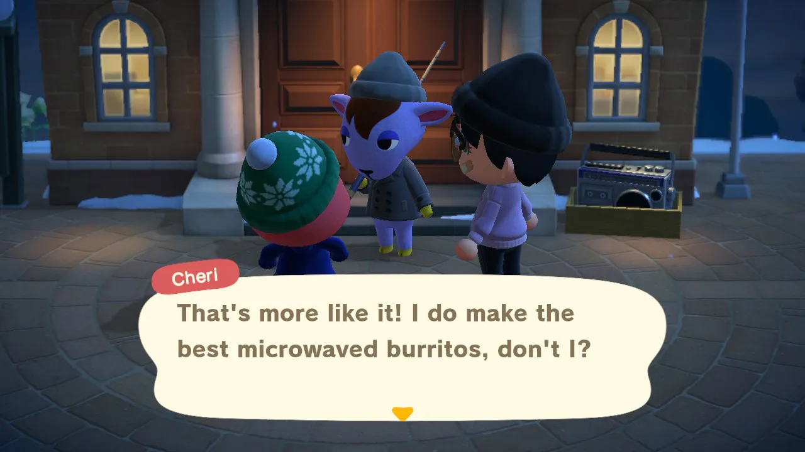

import { Image } from "astro:assets"
import Replay from './replay.webp'
import Miku from './miku.webp'

2025 has been... a year. not to doompost but a ton of stuff in 2025 sucks, such as the increasing RAM and SSD prices, the incresingly enshittification of everything, etc.  honestly, i don't have high hopes for 2026, but time will tell.

i'll try to talk about some stuff i've done throughout this year.

## things i've done

- i switched to iOS, right at the beginning of the year. 

i've always been an Android person because i liked that i could buy a mid-range phone, flash a clean custom ROM and be happy with it, but with the ever increasing hostilness from Google (fuck you attestation APIs), i've decided to move to an iPhone. 

kinda ironic considering that it's even more closed off, but at least i'm having a nice experience (even in iOS 26). i'm currently using an iPhone 16 Pro.

i'll hopefully learn native iOS dev in 2026

- i've gotten a Nintendo Switch (1, OLED)

i hadn't played anything Nintendo since... 2018?, back when I had a 3DS. i got an OLED Switch during the first half of the year to try out games like Animal Crossing and Splatoon, and i've enjoyed them so much. yes, the Switch 2 came out this year as well, but i'm okay with the OLED and i got a pretty good deal on it and games :)

- new favorite artist: Tyler, The Creator

i've started to like Tyler, The Creator a lot this year (in fact, he's my most listened artist this year). i love IGOR, CHROMAKOPIA and Don't Tap The Glass. 

<Image src={Replay} alt="Replay 2025" class="h-120 object-contain"/>

- i've gotten into collecting music CDs

just for fun. i've bought the physical CDs of SMILE :D and Nurture (Porter Robinson), CHROMAKOPIA and IGOR (Tyler, The Creator) and Serotonin Dreams (BoyWithUke). 

- self-hosting and a homelab!

i got a used mini PC that i've been using for self-hosting at home. it's a Lenovo ThinkCentre M900 Tiny. it has an i7-6400T (4c8t, 2.8GHz), 32 GB of RAM, a 480 GB SATA ADATA SU630 SSD and a 1 TB WD_BLACK SN770 NVME SSD.

i've been hosting Jellyfin (transcoding isn't great, but i can natively play everything on my laptop and phone), Pi-hole, Forgejo (and a runner) and more private things. i self-hosted GitLab (instead of Forgejo) for a couple of months but it's really heavy in resources (this mini PC had no problems running it, but 6 GB of RAM for a small instance? i know i could tweak it a lot but i still didn't like how heavy it was).

## media i consumed this year

- music (most listened/personal highlights)
    - Tyler, The Creator: chromakopia made me start listening. igor made me stay.
        - IGOR
        - CHROMAKOPIA
        - Don't Tap The Glass
    - Porter Robinson
        - SMILE :D
        - Nurture
        - Worlds
    - Daft Punk: i hadn't listened to them before, somehow. the Daft Punk Experience in Fortnite made me start listening.
        - Discovery
        - Human After All
    - Kendrick Lamar
        - good kid, m.A.A.d city
- anime 
    - I've Been Killing Slimes for 300 Years and Maxed Out My Level (both seasons)
    - I'm Getting Married to a Girl I Hate in My Class
    - My Dress-Up Darling (first season. haven't finished the second one)
    - Call of the Night (still need to finish watching the second season)
- movies
    - the minecraft movie
    - chainsaw man: reze's arc
    - colorful stage: the movie. miku can't sing (even brought a miku plushie)

<Image src={Miku} alt="Hatsune Miku plushie in a movie theater" class="h-120 object-contain"/>

    - tron: ares (didn't like the extreme AI glazing at the start, but it was... okay. legacy is still better imo)
    - tron: legacy (rewatched)
    - how to train your dragon
    - wargames
    - the social network
