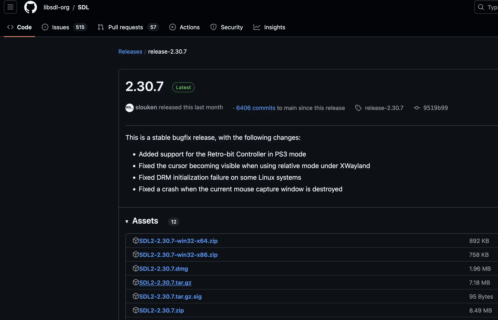

I wanted to play Celeste on macOS, but controller support seemed to be broken. a
quick Google search led me to a
[Reddit post](https://www.reddit.com/r/celestegame/comments/zeihph/how_to_fix_controller_support_on_macos/)
about this problem.

disabling Steam Input didn't work and the second solution is replacing the SDL2
library in the game with some precompiled version that is provided in the post,
and that seemed to work according to the comments, but I'm not willing to trust
a random binary from the internet :)

so here's a quick guide on compiling SDL2 on macOS to fix controller support on
Celeste

## some context

i was trying to run the Steam version of Celeste and use an Xbox One (S)
controller on macOS Sonoma (15) on an M3 Pro MacBook Pro.

## Xcode :(

download Xcode from the App Store. I used Xcode 16.0 16A242d. there must be a
way to compile it without it, but this is what I settled on

## download the SDL2 source code

download and extract the .tar.gz file from the
[SDL2 GitHub release page](https://github.com/libsdl-org/SDL/releases) (i tested
with [2.30.7](https://github.com/libsdl-org/SDL/releases/tag/release-2.30.7),
I'm not sure if it'll cause issues)



## terminal time!

open your terminal and cd into `[sdl2 folder]/Xcode/SDL/` and compile SDL2 with
the following command (it compiles a Release build of SDL2 as a shared library
for x64_64, because Celeste is an x86_64 binary)

```sh
xcodebuild -scheme "Shared Library" -configuration Release -arch x86_64 -derivedDataPath out build -quiet
```

the file that interests us is now in
`[sdl2 folder]/Xcode/SDL/out/Build/Products/Release/libSDL2.dylib`

## replace the SDL2 library in Celeste

go to Celeste.app, browse the package contents and copy the file into
`Contents/MacOS/osx`. either delete or move `libSDL2-2.0.0.dylib` and replace it
with the new one (keep the same name: `libSDL2-2.0.0.dylib`)


it should now work :)

<iframe
  class="aspect-video w-full"
  src="https://www.youtube-nocookie.com/embed/OvdSUbJUhes"
  title="YouTube video player"
  frameborder="0"
  allow="accelerometer; autoplay; clipboard-write; encrypted-media; gyroscope; picture-in-picture; web-share"
  referrerpolicy="strict-origin-when-cross-origin"
  allowfullscreen
  loading="lazy"
></iframe>
